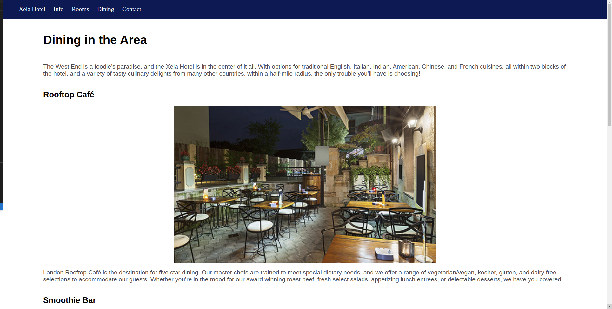
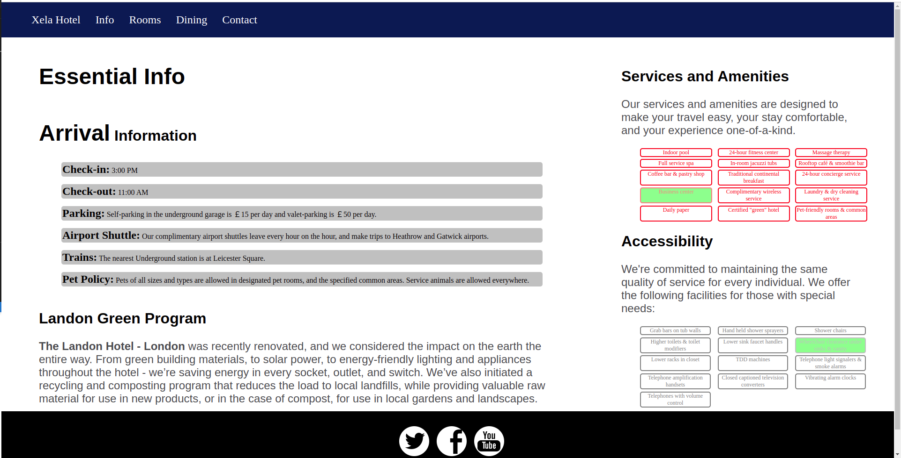
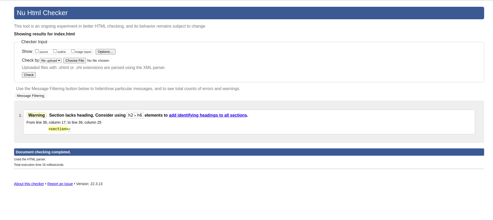
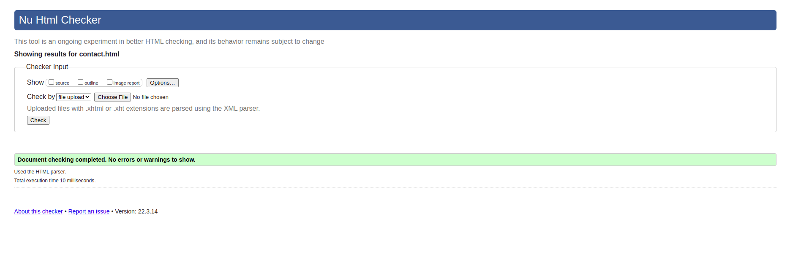
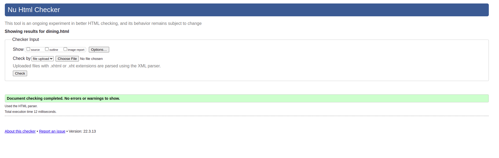
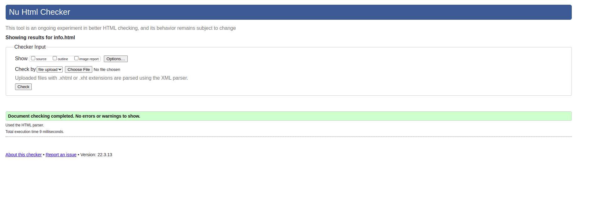
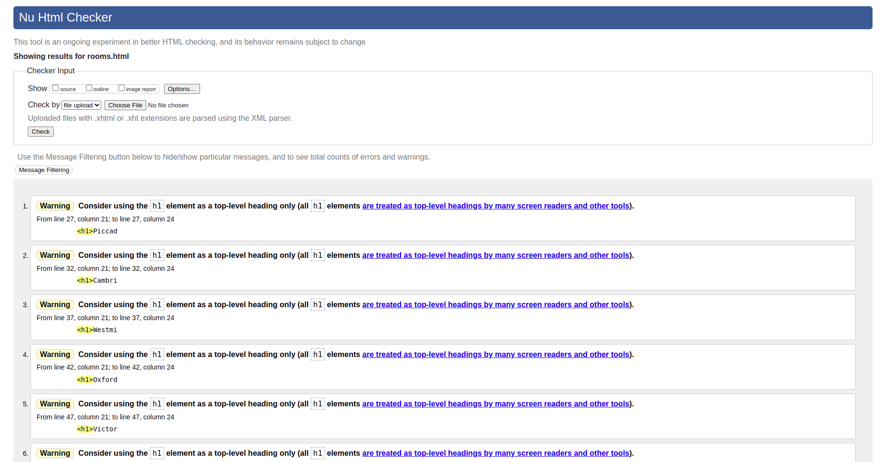

## Entregables:

### Captura de Resultados 📋
  
  
  
  
  

### Enlace a GithubPages 🚀

#### [Ir a GithubPage]( https://edpo1998.github.io/Practica1Html/index.html ) 

### Dificultades 🛠️

    Diria que debido a que he usado y trabajado con mucho 
    framework y pre-procesadores de css he utilizo y 
    practicado muy poco el css mismo en cuanto a su potencial.

### Validacion del Codigo 🔧
  
  
  
  
  

